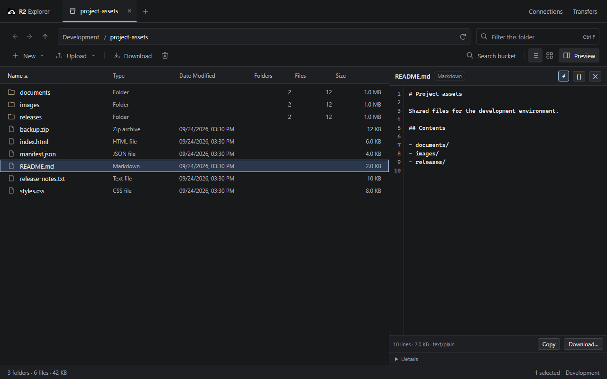
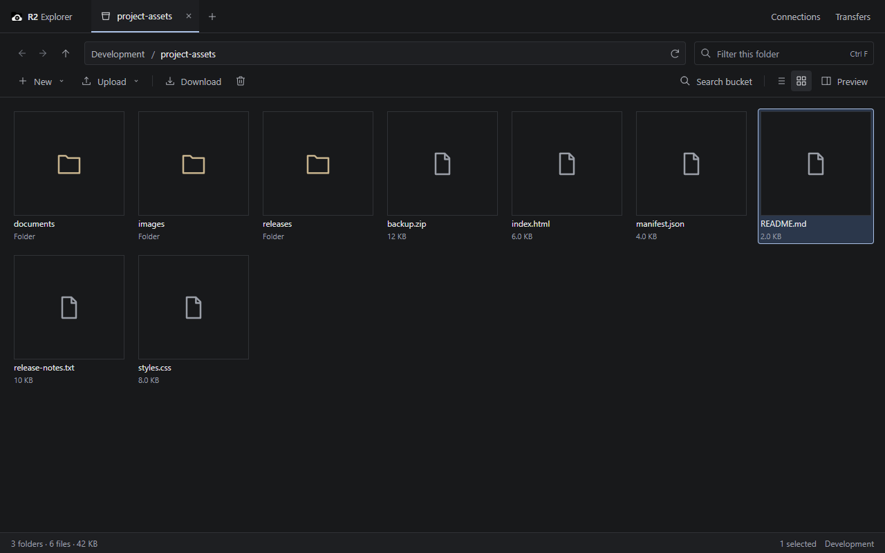
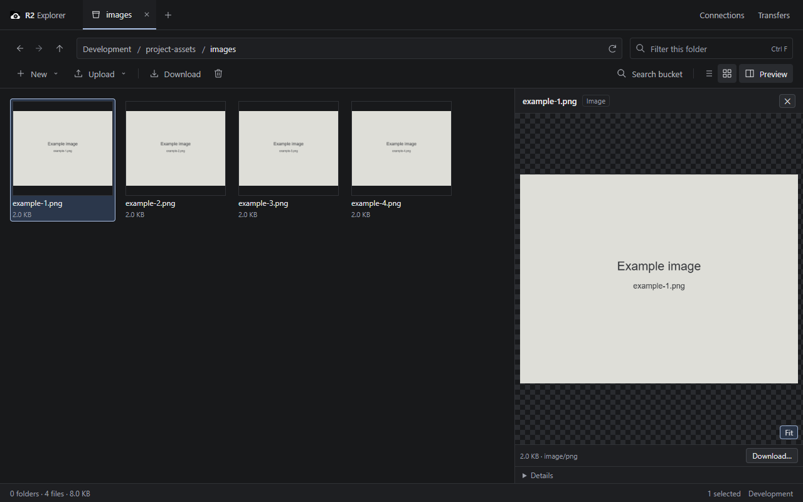
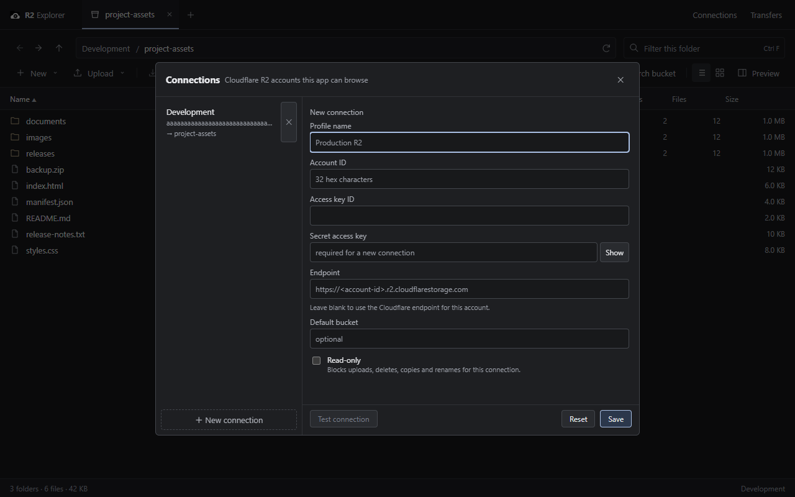

# AreTwo - R2 Explorer

A Windows desktop app for browsing and managing Cloudflare R2 buckets over the S3 API, built to behave like File Explorer rather than like a web dashboard. Tauri 2 shell, Rust backend (AWS S3 SDK), Vue 3 frontend. R2 credentials never reach the webview, and nothing sits between the app and R2.

## Feature previews

Screenshots use example connections, files, and generated placeholder images. No private R2 data is shown.

**File browsing and text preview** — inspect files beside the listing, with line numbers and wrapping.



<details>
<summary>Gallery view</summary>

Browse files and folders as tiles.



</details>

<details>
<summary>Image preview</summary>

View an image alongside the gallery.



</details>

<details>
<summary>Connection manager</summary>

Manage connections, credentials, and read-only access.



</details>

---

## Requirements

| Piece | Version used here | Notes |
| --- | --- | --- |
| Windows | 10 / 11 x64 | WebView2 runtime ships with Edge; the installer expects it present |
| Node.js | 22.15.0 | 20+ should work |
| pnpm | 11.11.0 | npm/yarn work too, commands below are pnpm |
| Rust | stable, 1.89.0 | `x86_64-pc-windows-msvc` toolchain |
| Visual Studio Build Tools | 2022 | "Desktop development with C++" workload — needed to link the exe |
| NSIS + WiX | auto-downloaded | `tauri build` fetches these into `%LOCALAPPDATA%\tauri` on first bundle |

Check what you have:

```powershell
node -v; pnpm -v; rustc -V; cargo -V
```

---

## Quick start

```powershell
pnpm install
pnpm tauri dev
```

The first launch opens an "Add R2 Connection" form (see [Connecting to R2](#connecting-to-r2)).

---

## Development (debug)

```powershell
pnpm tauri dev          # full app: Vite dev server + debug Rust binary + HMR
```

* Frontend edits hot-reload. Rust edits rebuild and restart the window.
* The webview loads `http://localhost:1420` (fixed port — `strictPort` is on, so something else on 1420 makes dev fail loudly).
* Debug binary: `src-tauri\target\debug\r2-explorer.exe`. `cargo build` alone embeds whatever is currently in `dist\`, so run `pnpm build` first if you care about the assets inside it.

Other dev commands:

```powershell
pnpm dev                                            # Vite only, in a browser — see the note below
pnpm build                                          # vue-tsc --noEmit && vite build (typecheck + dist)
cargo test --manifest-path src-tauri/Cargo.toml     # 10 unit tests, offline
node --experimental-strip-types scripts/rows.check.ts   # asserts on the pure frontend helpers
```

`pnpm dev` in a plain browser has no Tauri IPC, so the app cannot talk to R2. It now prints that in the window instead of throwing `Cannot read properties of undefined (reading 'invoke')`.

## Release build

```powershell
pnpm tauri build
```

Artifacts, all under `src-tauri\target\release\`:

| File | Size | Use |
| --- | --- | --- |
| `r2-explorer.exe` | ~11.6 MB | portable — run it directly, no install |
| `bundle\nsis\R2 Explorer_0.1.0_x64-setup.exe` | ~3.9 MB | installer (per-user, adds Start Menu entry) |
| `bundle\msi\R2 Explorer_0.1.0_x64_en-US.msi` | ~5.7 MB | MSI for managed deployment |

Useful variants:

```powershell
pnpm tauri build --no-bundle     # just the release exe, skips installer tooling
pnpm tauri build --debug         # release bundling with a debug binary (faster compile)
pnpm tauri build --bundles nsis   # NSIS installer only
```

Notes:

* The build embeds `dist\` — `beforeBuildCommand` runs `pnpm build` for you, so never ship a stale frontend.
* Builds are **unsigned**. Windows SmartScreen will warn on first launch of a downloaded copy; that needs a code-signing certificate (not configured yet).
* Artifact names come from `productName` in `src-tauri\tauri.conf.json` (`"R2 Explorer"`, hence the space). Change it to `R2Explorer` if you want `R2Explorer_0.1.0_x64-setup.exe`.
* Config lives in `%APPDATA%\R2Explorer\`, caches nowhere yet — deleting that folder resets the app.

---

## Connecting to R2

You need four values from the Cloudflare dashboard (R2 → **Manage R2 API Tokens** → create a token with Object Read & Write, scoped to the bucket):

| Field in the app | Where it comes from |
| --- | --- |
| Profile name | Anything you like, e.g. `Development` |
| Account ID | 32 hex chars, shown in the R2 overview / dashboard URL |
| Access key ID | The token's Access Key ID |
| Secret access key | The token's Secret Access Key (shown once) |
| Endpoint | Leave blank — derived as `https://<account-id>.r2.cloudflarestorage.com` |
| Default bucket | Optional; the tab opens here |

Two things that bite people:

1. **The endpoint is a bare host.** `https://<account-id>.r2.cloudflarestorage.com/example-bucket` is a *URL to a bucket*, not an S3 endpoint. The dialog strips a pasted `/bucket` tail automatically, and empty means "derive it from the account ID".
2. **A custom domain** (e.g. `assets.example.com`) is for public delivery. It is not the S3 API and the app ignores it.

Read-only connections: tick the box and every mutating command (upload, create, copy, rename, delete) is refused by a single guard in the Rust layer, not by UI checks.

---

## Features

**Browsing** — connections, buckets, prefixes-as-folders, tabs (`Ctrl+T`), per-tab back/forward history, breadcrumb + `r2://` address bar, filter, pagination over large prefixes, 26px density, virtualized table (only visible rows exist in the DOM).

**Columns** — Name, Type, Date Modified, Folders, Files, Size by default; ETag, Storage Class, Extension, Full Key via right-click on the header; drag to resize; sortable; layout persists.

**Folder statistics** — R2 has no folders, so Folders/Files/Size per row cost a paginated scan. They load lazily for visible rows only, three at a time, cached 30 minutes, with right-click → Calculate / Refresh folder statistics.

**Preview** — images (fit/100%, `data:` URLs, oversized files refused before download), text and code with a line-number gutter, wrapping, JSON pretty-print, line/size/type footer, Copy; folder preview shows the same stats as the columns; unknown types fall back to metadata.

**Gallery** — virtualized tile grid for image-heavy buckets; tiles fetch a capped image only when they scroll into view; memory-bounded cache.

**Transfers** — queue with three parallel jobs, real byte progress (multipart above 8 MiB), speed/ETA, cancel, retry, pause, clear finished, Windows taskbar progress, drag-and-drop upload from Explorer (folders are walked recursively, symlinks skipped), per-folder download that keeps the structure.

**File management** — upload, upload folder, download, download folder, new folder, new file, rename (implemented as copy + delete, since S3 has no rename), copy to another prefix, delete (batched 1000 keys per request), multi-select, confirmation dialog for destructive actions.

**Search** — filter the current listing instantly, or search the whole bucket with wildcards: `*.webp`, `manga/*/01.webp`, or plain substrings. Server-side scan, 50-page cap, reports how much it scanned.

**Sharing** — copy object key, copy `r2://` URI, create a presigned GET link (5 min / 1 h / 24 h / 7 days / custom, capped at R2's 7-day maximum).

**Properties** — size, content type, modified, ETag, storage class, cache-control, custom metadata, plus prefix stats for folders.

---

## Keyboard shortcuts

| Key | Action |
| --- | --- |
| `Enter` | Open folder / preview file |
| `Backspace`, `Alt+↑` | Parent folder |
| `Alt+←`, `Alt+→` | Back / forward |
| `F5` | Refresh |
| `F2` | Rename |
| `Delete` | Delete selection (confirms) |
| `Ctrl+A` | Select all |
| `Ctrl+F`, `/` | Focus filter |
| `Ctrl+L` | Focus address bar |
| `Alt+Enter` | Properties |
| `Ctrl+T` / `Ctrl+W` | New tab / close tab |
| `Ctrl+Shift+T` | Reopen closed tab |
| `Ctrl+Tab` / `Ctrl+Shift+Tab` | Cycle tabs |
| `↑` / `↓` | Move selection |
| `Esc` | Dismiss the context menu / close an open dialog |
| middle-click | Close tab |

---

## Architecture

```
Vue 3 webview (density-focused UI)
   │  invoke("command", { camelCaseArgs })            ▲  event "transfer://progress"
   ▼                                                  │
Rust backend (src-tauri/src)
   ├── lib.rs    23 #[tauri::command]s
   ├── r2.rs     S3 client, pagination, prefix stats, search, copy/delete, presign
   ├── store.rs  profiles.json + credentials.dat
   ├── dpapi.rs  CryptProtectData/CryptUnprotectData wrapper
   └── walk.rs   expands dropped folders into upload lists
   │
   ├── aws-sdk-s3 (path-style, region "auto") ──▶ Cloudflare R2
   └── %APPDATA%\R2Explorer\  (profiles + sealed secrets)
```

Security boundaries:

* The **secret access key never reaches the frontend** — profile JSON holds the access key ID only; the secret is DPAPI-sealed (`credentials.dat`, per-user, no entropy) and unsealed inside the Rust client.
* Mutating commands funnel through one `write_conn()` guard, so read-only cannot be bypassed by adding a command later.
* `tauri.conf.json` sets a CSP; the capability file grants only `core:default`, `opener:default`, `dialog:default`.
* Previewed content is downloaded as bytes and rendered by the webview; nothing is executed from the bucket.

Where state lives:

| What | Where |
| --- | --- |
| Profiles (no secrets) | `%APPDATA%\R2Explorer\profiles.json` |
| DPAPI-sealed secrets | `%APPDATA%\R2Explorer\credentials.dat` |
| Column layout | `localStorage["r2explorer.columns.v1"]` |
| View mode (details/gallery) | `localStorage["r2explorer.view"]` |
| Preview pane width | `localStorage["r2explorer.previewWidth"]` |

---

## Project layout

```
src/
  App.vue                  shell: tabs, navigation, menu, dialogs, keyboard map
  api.ts                   the only place that calls invoke()
  rows.ts                  pure helpers: rows, sorting, filtering, formatting, labels
  types.ts                 wire contract with the Rust side (camelCase)
  components/
    ExplorerTable.vue      virtualized details table, resizable/toggleable columns
    GalleryView.vue        virtualized tile grid
    PreviewPane.vue        code/image/folder preview
    ProfilesDialog.vue     connection manager
    PropertiesDialog.vue   object properties
    PresignDialog.vue      temporary links
    TransfersPanel.vue     queue UI
    ContextMenu.vue        shared menu
  stores/
    transfers.ts           queue, progress events, taskbar progress
    folderStats.ts         cached prefix scans
    thumbs.ts              bounded image cache for the gallery
    dnd.ts                 drag-and-drop upload wiring
scripts/rows.check.ts      assert-based self-check for rows.ts
src-tauri/src/             Rust backend (see Architecture)
```

Harness files (`harness-tasks.json`, `harness-progress.txt`, `.harness-active`) drive long-running agent work and are gitignored — they are not part of the app.

---

## Testing

Offline (always safe):

```powershell
cargo test --manifest-path src-tauri/Cargo.toml        # unit tests incl. prefix maths, copy-source encoding, wildcard search, DPAPI round trip
node --experimental-strip-types scripts/rows.check.ts  # pure frontend logic
pnpm build                                             # types + bundle
```

Live smoke test against a real bucket (writes and then deletes objects):

```powershell
$env:R2_PROFILE_ID = "your-profile-id"  # a saved profile id from %APPDATA%\R2Explorer\profiles.json
$env:R2_BUCKET     = "your-test-bucket"
cargo test --manifest-path src-tauri/Cargo.toml -- --ignored --nocapture live_
```

It walks a bucket, scans one prefix, searches `*.webp`, uploads/downloads a small file and a 10 MiB file (multipart), fetches a presigned URL with `curl` and asserts HTTP 200, copies a key containing spaces and Japanese characters, and deletes everything it created under `_r2explorer-smoketest/`. It is skipped unless `--ignored` is passed.

Both environment variables are required; the test has no default account or bucket. Use a dedicated test bucket. UI checks use mocked R2 data; live operations require your own credentials.

---

## Troubleshooting

| Symptom | Cause | Fix |
| --- | --- | --- |
| `Cannot read properties of undefined (reading 'invoke')` | UI opened without the Tauri shell (browser tab, `dist/index.html`) | run `pnpm tauri dev` or the built exe |
| `403`, `SignatureDoesNotMatch`, `NoSuchBucket` on connect | endpoint includes a bucket path, wrong account ID, or a read-only token used for a write | blank the endpoint, re-check the 32-char account ID, check the read-only flag |
| Presigned link stops working | expired (max 7 days) or the object was renamed | create a new link |
| `pnpm tauri dev` fails: port in use | something else owns 1420 | stop it, or change `server.port` in `vite.config.ts` |
| Window is blank on a fresh machine | WebView2 runtime missing (rare on Win10/11) | install the Evergreen WebView2 runtime |
| First `cargo build` seems hung | it is compiling `aws-sdk-s3` + `tauri` | let it run (~13 min), later builds are incremental |
| SmartScreen warning on the installer | unsigned build | sign it (`pnpm tauri signer`) or run anyway |
| Rename/copy fails on keys with spaces or CJK | would be a bug in `encode_copy_source` | it is unit-tested and live-verified; report it |
| Uploads show 0% then 100% | files under 8 MiB go as a single PutObject | real byte progress starts at 8 MiB (multipart) |

---

## Known gaps

* No PDF / XLSX / DOCX / archive preview — images, text, code and metadata only.
* No on-disk thumbnail cache and no SQLite metadata index; folder stats and search rescan R2 (cached in memory for 30 minutes).
* Pause is queue-level; a transfer in flight can only be cancelled and retried.
* No cut/paste shortcut — a "move" is Copy to… followed by deleting the source.
* No drag-out to Explorer, no code signing, no auto-update.
* UI is dark-only and English-only.

---

## Recommended editor setup

VS Code + [Vue - Official](https://marketplace.visualstudio.com/items?itemName=Vue.volar) + [Tauri](https://marketplace.visualstudio.com/items?itemName=tauri-apps.tauri-vscode) + [rust-analyzer](https://marketplace.visualstudio.com/items?itemName=rust-lang.rust-analyzer).

## License

Not specified yet.
